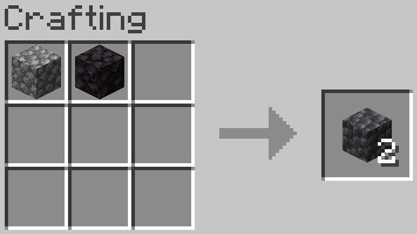
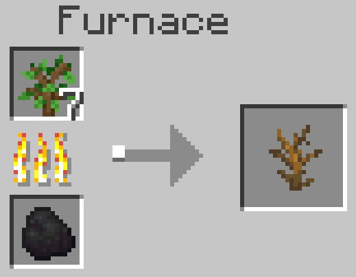
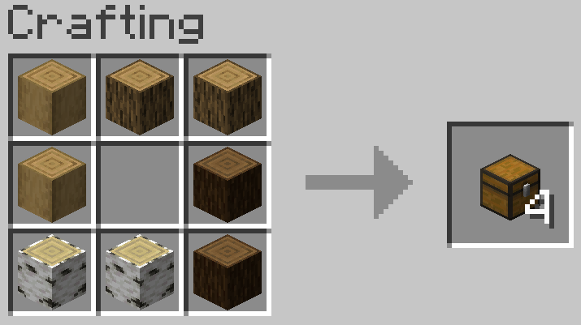
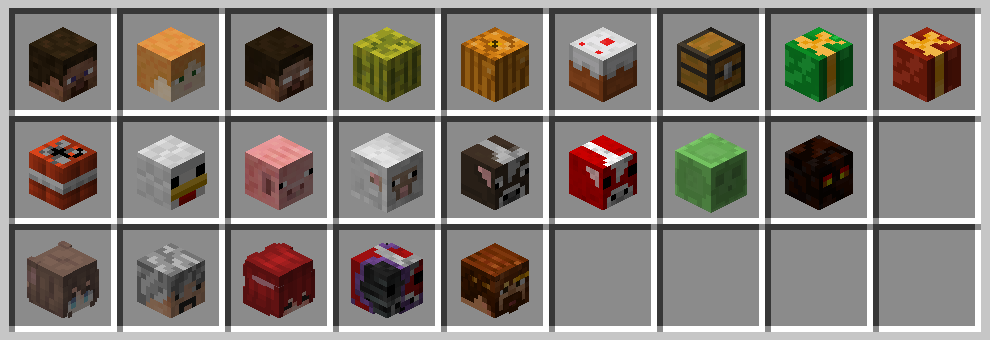

# PoTAto10O's CraftPlusPlus

**English** | [简体中文](README_ZH_CN.md)

PoTAto10O's CraftPlusPlus is a Minecraft data pack, designed to be used in my own survival game.

Design  renewable recipes for some non-renewable resources. Design some more convenient recipes. And add recipes for some platers' heads that can be used in survival games.

Currently only designed for 1.21-1.21.1, used in my own 1.21.1 games, and not tested in other game versions.

The data pack generator by misode helped a lot in the development of this data pack。([Website](https://misode.github.io/) | [GitHub Repo](https://github.com/misode/misode.github.io))

## All new recipes

### Non-renewable resources

```
Cobblestone + Blackstone = Cobbled Deepslate*2
Basalt + Quartz = Tuff
Tuff + Quartz = Calcite

String|      |String
      |String|       = Cobweb
String|      |String

Any Sapling + Smelting = Dead Bush (0.1 xp, 200gt time)
```

### Convient recipes

```
Log|Log|Log
Log|   |Log = Chest*4
Log|Log|Log

      |String |Stick
String|Dropper|Stick = Dispenser
      |String |Stick

Melon = Melon Slice*9

Soul Sand = Soul Soil
```

*Soul soil can be obtained by breaking soul campfire. Here a cheaper and more convenient way to obtain soul soil is added.*

### Ore recipes

Ores are non-renewable in vanilla games. Considering that ores are occasionally used as building blocks, new recipes have been added to facilitate material acquisition. For most ores, by repeatedly crafting and mining them with a Fortune III pickaxe, the expected net yield of minerals should be negative. However, since diamonds are non-renewable in the vanilla game, their expected yield has been deliberately designed to be positive.

For coal/iron/gold/emerald, their corresponding ores and deepslate variants can be obtained using the following recipe:

```
 |@| 
@|#|@
 |@| 
 
@ represents coal/iron_ingot/gold_ingot/emerald; # represents stone/deepslate
Note: charcoal and cobblestone cannot be used in this recipe.
```

For copper/lapis/redstone, their corresponding ores and deepslate variants can be obtained using the following recipe:

```
@|@|@
@|#|@
@|@|@
 
@ represents copper_ingot/lapis/redstone; # represents stone/deepslate
```

For diamond, their corresponding ores and deepslate variants can be obtained using the following recipe:

```
 |@| 
@|#|@ = Corresponding Ore*2
 |@| 
 
@ represents diamond; # represents stone/deepslate
```


Nether gold ore/nether quartz ore/gilded blackstone  can be obtained using the following recipe:

```
 |@| 
@|#|@
 |@| 
 
@ represents gold_ingot/quartz；# represents netherrack/blackstone
```

### Coral recipes

coral and coral fans are renewable, but coral blocks are not. Considering coral blocks, especially dead brain coral blocks, are sometimes used as building block, here provide recipes for coral blocks. Also some coral-and-coral-fans conversion  recipes are added for convenience.

```
Coral = Coral Fan
Coral Fan = Coral

Coral|Coral
Coral|Coral = Coral Block
```

### Player head recipes

Marc Watson provided a series of common heads with player id in the format of `MHF_Something`。This data pack provides recipes for part of the MHF heads and some recipes for other players' heads that can be used in survival mode.

```
========== MHF Heads ==========
Wither Skeleton Skull + Crafting Table = MHF_Steve's Head
Wither Skeleton Skull + Sea Lantern = MHF_Alex's Head
Wither Skeleton Skull + Nether Star = MHF_Herobrine's Head
Wither Skeleton Skull + Melon = MHF_Melon's Head
Wither Skeleton Skull + Pumpkin = MHF_Pumpkin's Head
Wither Skeleton Skull + Cake = MHF_Cake's Head
Wither Skeleton Skull + Chest = MHF_Chest's Head
Wither Skeleton Skull + Spruce Sapling = MHF_Present1's Head
Wither Skeleton Skull + Trapped Chest = MHF_Present2's Head
Wither Skeleton Skull + TNT = MHF_TNT2's Head
Wither Skeleton Skull + Egg = MHF_Chicken's Head
Wither Skeleton Skull + Carrot on a Stick = MHF_Pig's Head
Wither Skeleton Skull + Wool = MHF_Sheep's Head
Wither Skeleton Skull + Leather = MHF_Cow's Head
Wither Skeleton Skull + Red Mushroom = MHF_MushroomCow's Head
Wither Skeleton Skull + Slime Block = MHF_Slime's Head
Wither Skeleton Skull + Magma Block = MHF_LavaSlime's Head

========= Player's Heads =========
Wither Skeleton Skull + Poisonous PoTAto10O = PoTAto10O's Head
Wither Skeleton Skull + Redstone = hsds's Head
Wither Skeleton Skull + Feather = U_ruby's Head
Wither Skeleton Skull + Brown Mushroom = Xe_Kr's Head
Wither Skeleton Skull + Grass Block = zi_min's Head
```

## Screenshots







