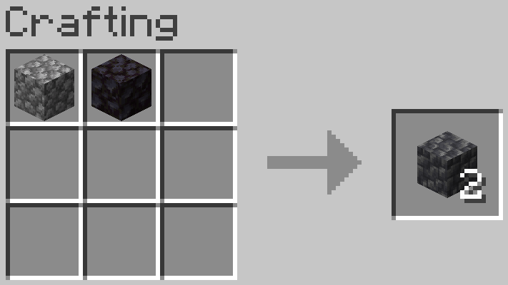
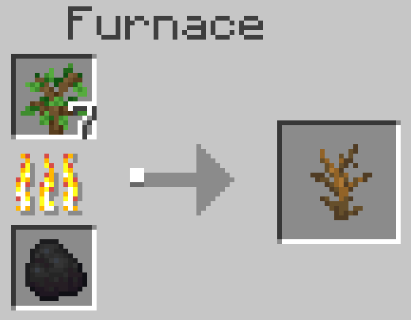
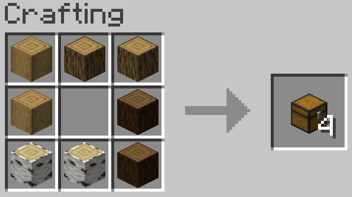
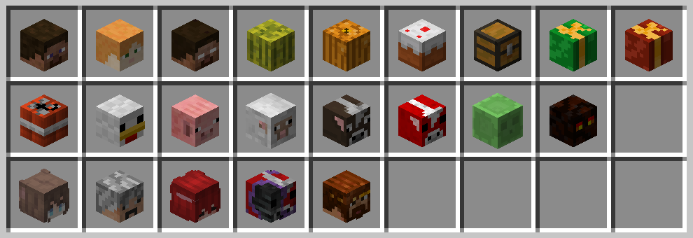

# PoTAto10O's CraftPlusPlus

[English](README.md) | **简体中文**

PoTAto10O 的 CraftPlusPlus 是一款自用于我自己 Minecraft 生存存档的数据包。

为一些不可再生资源设计了可再生的合成方法，为一些可再生资源添加了更方便的合成表，并为一些有趣的玩家头颅添加了生存可用的合成配方。

目前只为 1.21-1.21.1 设计，在 1.21.1 的存档中自用，其他版本未经过测试。

misode 的数据包生成器为本数据包的开发提供了极大的便利。([网站](https://misode.github.io/) | [GitHub 仓库](https://github.com/misode/misode.github.io))

## 添加的合成表一览

### 不可再生资源

```
圆石 + 黑石 = 深板岩圆石*2
玄武岩 + 石英 = 凝灰岩
凝灰岩 + 石英 = 方解石

线|空|线
空|线|空 = 蜘蛛网
线|空|线

任意树苗 + 烧炼 = 枯萎的灌木 (0.1 经验, 200gt 烧炼时间)
```

### 可再生资源的便利合成

```
原木|原木|原木
原木|空空|原木 = 箱子*4
原木|原木|原木

空|线   |木棍
线|投掷器|木棍 = 发射器
空|线   |木棍

西瓜 = 西瓜片*9

灵魂沙 = 灵魂土
```

*灵魂土可以通过破坏由灵魂沙合成的灵魂篝火来再生，此处为其添加更便利也更廉价的再生方式*

### 矿石的合成

原版的矿石是不可再生的，考虑到矿石会被少量地用作建筑材料，此处为矿石添加了合成表以方便材料获取。对于大部分矿石，通过不断地合成并用时运III的镐子挖取，其期望的矿物获取量应当是负的。考虑到钻石在原版中不可再生，钻石的期望收益被特地地设计为正的。

对于煤/铁/金/绿宝石，其对应的矿石及其深板岩变种可以由如下合成表获取：

```
 |@| 
@|#|@
 |@| 
 
@代表煤炭/铁锭/金锭/绿宝石；#代表石头/深板岩
请注意木炭和圆石不可用于此合成表
```

对于铜/青金石/红石，其对应的矿石及其深板岩变种可以由如下合成表获取：

```
@|@|@
@|#|@
@|@|@
 
@代表铜/青金石/红石；#代表石头/深板岩
```

对于钻石，其对应的矿石及其深板岩变种可以由如下合成表获取：

```
 |@| 
@|#|@ = 对应矿石*2
 |@| 
 
@代表钻石；#代表石头/深板岩
```

下界金矿石/下界石英矿石/镶金黑石可以由如下合成表获取：

```
 |@| 
@|#|@
 |@| 
 
@代表金锭/石英；#代表下界岩/黑石
```

### 珊瑚的合成

珊瑚与珊瑚扇可再生，但珊瑚块不可再生。考虑到珊瑚块，尤其是失活的脑珊瑚块，在建筑中常用，因此为珊瑚块提供了合成表。并添加了珊瑚与珊瑚扇的转化。

```
珊瑚 = 珊瑚扇
珊瑚扇 = 珊瑚

珊瑚|珊瑚
珊瑚|珊瑚 = 珊瑚块
```

### 玩家头颅的合成

Marc Watson 通过一些形如 `MHF_xxx` 的玩家 id，提供了一系列的装饰性头颅。本数据包提供了部分在生存中合成这些头颅配方，并提供了少量其他玩家的头颅的合成配方。

```
======== MHF装饰性头颅系列 ========
凋灵骷髅头颅 + 工作台 = Steve的头
凋灵骷髅头颅 + 海晶灯 = Alex的头
凋灵骷髅头颅 + 下界之星 = Herobrine的头
凋灵骷髅头颅 + 西瓜 = 西瓜的头
凋灵骷髅头颅 + 南瓜 = 南瓜的头
凋灵骷髅头颅 + 蛋糕 = 蛋糕的头
凋灵骷髅头颅 + 箱子 = 箱子的头
凋灵骷髅头颅 + 云杉树苗 = 绿色圣诞礼物的头
凋灵骷髅头颅 + 陷阱箱 = 红色圣诞礼物的头
凋灵骷髅头颅 + TNT = TNT2的头
凋灵骷髅头颅 + 鸡蛋 = 鸡的头
凋灵骷髅头颅 + 胡萝卜钓竿 = 猪的头
凋灵骷髅头颅 + 羊毛 = 羊的头
凋灵骷髅头颅 + 皮革 = 牛的头
凋灵骷髅头颅 + 红色蘑菇 = 哞菇的头
凋灵骷髅头颅 + 史莱姆块 = 史莱姆的头
凋灵骷髅头颅 + 岩浆块 = 岩浆怪的头

========== 玩家头颅 ==========
凋灵骷髅头颅 + 毒马铃薯 = PoTAto10O的头
凋灵骷髅头颅 + 红石 = hsds的头
凋灵骷髅头颅 + 羽毛 = U_ruby的头
凋灵骷髅头颅 + 棕色蘑菇 = Xe_Kr的头
凋灵骷髅头颅 + 草方块 = zi_min的头
```

## 游戏截图







